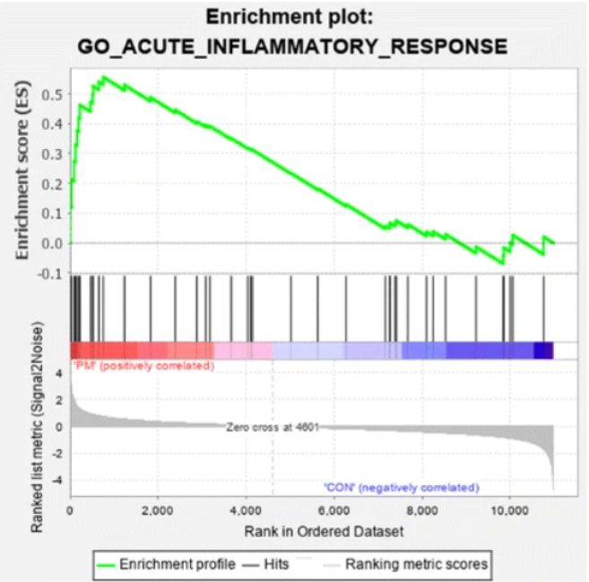

## Sequencing Read Quality from MultiQC Report
The sequencing reads are of generally good quality. The reads have a
mean phred score \> 30, illustrating high per-base sequence quality.
Furthermore, there was minimal degradation over entire sequence reads.
The GC content also aligns an expected normal distribution, indicating
little bias in reads. However, each of the samples exhibited
non-negligible sequence duplication levels. Overall, the QC metrics are
satisfactory, allowing us to continue with downstream analyses.

## Pre-filtering
Since we are performing differential expression analysis, we want to look at genes that are significant within the batches. Because the data is so large, it may be necessary to filter out genes that are unaffected in each of the six batches. Therefore, all unexpressed but recorded genes will be filtered out from the analysis. Essentially, the filtering removes any genes that have been counted zero times in more than two batches.

\newline

Here are the results of pre-filtering on the counts matrix
```{r, echo=FALSE}
library(ggplot2)

# read counts matrix
counts_matrix = read.table("concat_counts.csv", header=TRUE, sep="\t")

# reorder columns
counts_matrix = counts_matrix[, c(1,6,5,4,3,7,2)]


# filter out all uncounted genes
filtered_counts = counts_matrix[rowSums(counts_matrix[, -1] > 0) >= 2, ]
```

\newline

Before filtering:
```{r, echo=FALSE}
head(counts_matrix)
```

\newline

After filtering:
```{r, echo=FALSE}
head(filtered_counts)
```

```{r, echo=FALSE}
num_genes_before = nrow(counts_matrix)
num_genes_after = nrow(filtered_counts)

# exclude gene name column
total_counts_before = rowSums(counts_matrix[, -1])
total_counts_after = rowSums(filtered_counts[, -1])

# combine data with condition
data = data.frame(
  total_counts = c(total_counts_before, total_counts_after),
  condition = rep(c("Before Filtering", "After Filtering"),
                  times = c(length(total_counts_before), length(total_counts_after)))
)

# display nrow before and after filtering
filtered_counts_table = data.frame(
  Before_Filtering = num_genes_before,
  After_Filtering = num_genes_after
)
print(filtered_counts_table)

# plot counts before and after
ggplot(data, aes(x = condition, y = total_counts)) +
  geom_boxplot() +
  labs(title = "Total Counts per Gene Before and After Filtering",
       x = "Condition", y = "Total Counts") +
  theme_minimal()
```

## Differential Expression Analysis
Here is the matrix of filtered raw counts
```{r, echo=FALSE, message=FALSE}
library(DESeq2)

condition = factor(c(rep(c("exp", "control"), 3)))

# store as matrix datatype without gene names
raw_counts = as.matrix(filtered_counts[-1])

gene_names = filtered_counts[[1]]

row.names(raw_counts) = gene_names

head(raw_counts)
```
After carrying out a differential expression analysis with a p~adj~ < 0.05, here are the 10 most significant genes:
```{r, echo=FALSE, message=FALSE}
# create the colData dataframe
col_data = data.frame(condition = condition)

# create DESeqDataSet
dds = DESeqDataSetFromMatrix(countData = raw_counts,
                              colData = col_data,
                              design = ~ condition)

dds = DESeq(dds)

res = results(dds, alpha = 0.05)

# filter significant results (padj < 0.05)
significant_genes = res[which(res$padj < 0.05), ]

# report the number of significant genes
num_significant_genes = nrow(significant_genes)
cat("Number of significant genes at padj < 0.05:", num_significant_genes, "\n")

top_genes = head(significant_genes[order(significant_genes$padj), ], 10)

top_genes
```

These genes very likely differentially expressed:
```{r, echo=FALSE}
sig_gene_names = row.names(top_genes)

print(sig_gene_names)

writeLines(sig_gene_names, "../results/sig_genes.txt")
```

#### DAVID Analysis

Performing a functional annotation analysis on these differentially expressed genes on David was rather inconclusive. Half of the genes were indicated as associated with disease, suggesting that the experimental condition affects pathways attributed to specific diseases. Functionally (considering gene functions can overlap), 25% of the genes are involved biological processes like immune response. Another 25% associated for both molecular function and post-translational modifications. 37% were related to sequence features in genes. None of the differentially expressed genes were clustered which could indicate wide-spread influence of the disease being studied. 

## Quality Control Plots

The counts matrix will be normalized with rlog to smooth variance across gene counts. 
```{r, echo=FALSE}
# rlog normalization
rlog_counts = rlog(dds, blind=FALSE)

normalized_counts = assay(rlog_counts)

head(normalized_counts)
```

#### Principal Component Analysis
PCA will be performed to view how samples are distributed along the first two principal components. 
```{r, echo=FALSE}
# perform pca
pca = prcomp(t(normalized_counts))

# separate by experimental condition
pca_df = data.frame(PC1 = pca$x[,1], PC2 = pca$x[,2], condition = col_data$condition)

ggplot(pca_df, aes(x = PC1, y = PC2, color = condition)) +
  geom_point(size = 2) +
  labs(title = "PCA: PC1 vs PC2", x = "PC1", y = "PC2") +
  theme_minimal() +
  scale_color_manual(values = c("exp" = "red", "control" = "blue"))
```

\newline

The Principal Component Analysis biplot comparing PCA1 vs. PCA2 allows us to see any major sources of variation in the data. This visualization suggests that the experimental condition has a powerful & consistent effect on gene expression across all replicates for this gene group. This is why the replicates exhibited to the experimental condition are all clustered together. In contrast, the control samples exhibit much more variability. This could possibly be due to the batch effect or other biological variability. Overall, the separation & clustering between the two conditions highlights that the experimental condition is driving differences in gene expression.

#### Heatmap
Here is a heatmap to visualize the pairwise distances between samples to assess the relationship between samples and identify outliers.
```{r, echo=FALSE}
library(pheatmap)

# create pairwise distance matrix
dist_matrix = as.matrix(dist(t(normalized_counts)))

# make heatmap with distance matrix
pheatmap(dist_matrix, 
         clustering_distance_rows = "euclidean", 
         clustering_distance_cols = "euclidean",
         main = "Normalized Counts Heatmap",
         color = colorRampPalette(c("white", "blue"))(50))
```

\newline   

The heatmap corroborates the results of the PCA biplot and reveals a clear separation between the experimental and control conditions. There is a high amount of "heat" or distance between replicates with different experimental conditions. For example, the exp_rep1 and control_rep3 replicates have approximately the maximum heat of 25. In contrast, replicates within the same condition typically have much less distance between them (the distance likely comes from the batch effect or standard biological variability). Once again, this plot indicates that the experimental condition is in fact driving significant changes in gene expression.


## Gene Set Enrichment Analysis with fgsea
The fgsea package does not take ensembl IDs, so the ensembl IDs are converted to gene symbols. (Biomart is currently down on the ensembl website, so the biomaRt package is not able to fetch data from their API. I am using an alternative library that is cutting my observed genes in half because it is unable to map all of the ensembl gene IDs).
```{r, echo=FALSE, message=FALSE, warning=FALSE}
library(fgsea)
library(msigdbr)
library(ggplot2)
library(biomaRt)
library(org.Hs.eg.db)
library(dplyr)

# remove variant suffixes from gene names
#rownames(res) = gsub("\\.\\d+$", "", rownames(res))

parsed_gtf = read.table("../results/gtf_parsed.txt", header=FALSE, sep="\t", stringsAsFactors=FALSE)
colnames(parsed_gtf) = c("Ensembl", "Symbol")

parsed_gtf = parsed_gtf[!duplicated(parsed_gtf$Ensembl), ]

valid_ensembl = rownames(res) %in% parsed_gtf$Ensembl
res = res[valid_ensembl, ]

rownames(res) <- parsed_gtf$Symbol[match(rownames(res), parsed_gtf$Ensembl)]

head(rownames(res), 15)

# find gene symbols from ensembl
#gene_symbols = AnnotationDbi::select(org.Hs.eg.db,
#                                    key=rownames(res), 
#                                    columns="SYMBOL",
#                                    keytype="ENSEMBL")

# remove null symbols
#gene_symbols = gene_symbols[!is.na(gene_symbols$SYMBOL), ]

# set gene symbols as row names in deseq results
#res = res[rownames(res) %in% gene_symbols$ENSEMBL, ]
#rownames(res) = gene_symbols$SYMBOL[match(rownames(res), gene_symbols$ENSEMBL)]

#head(gene_symbols, 15)

# biomaRt had an SSL handshake connection error, kept getting error 500
#ranks = ranked_genes$log2FoldChange

#names(ranks) = rownames(ranked_genes)

#ensembl = useMart("ensembl", dataset = "hsapiens_gene_ensembl")

# convert ensembl ids
#gene_symbols = getBM(attributes = c("ensembl_gene_id", "hgnc_symbol"),
#                      filters = "ensembl_gene_id",
#                      values = rownames(ranked_genes),  # Ensembl IDs from DESeq2 results
#                      mart = ensembl)

#head(gene_symbols)
```

Then, fgsea can be run on the differential expression analysis results. Here are most significant pathways, ranked by p~adj~:

```{r, echo=FALSE, message=FALSE, warning=FALSE}
# get statistic col
ranked_stats = res$stat

# make sure gene names are preserved
names(ranked_stats) = rownames(res)

# rank observations
ranked_stats = ranked_stats[order(ranked_stats, decreasing = TRUE)]

# use msigdb with C2 canonical pathways 
msigdb = msigdbr(species = "Homo sapiens", category = "C2")

# split by gene set
gene_sets = msigdb %>%
  split(.$gs_name) %>%
  lapply(function(x) x$gene_symbol)

# run a gse analysis
fgsea_results = fgsea(pathways = gene_sets, 
                       stats = ranked_stats, 
                       minSize = 15,
                       maxSize = 500)

# get most significant results by padj
top_fgsea_results = fgsea_results[order(fgsea_results$pval), ]
```

```{r, echo=FALSE}
# get top 15 most enriched pathways
top_significant_pathways <- fgsea_results[fgsea_results$pval < 0.05, ]
top_significant_pathways = top_significant_pathways[order(top_significant_pathways$pval), ][1:15]

# cut pathway name to fit in plot
top_significant_pathways$pathway <- substr(top_significant_pathways$pathway, 1, 30)

ggplot(top_significant_pathways, aes(x = reorder(pathway, -pval), y = -log10(pval))) +
  geom_bar(stat = "identity") +
  coord_flip() +
  labs(title = "Top GSEA Pathways Enriched",
       x = "Pathway",
       y = "-log10(pval)") +
  theme_minimal() +
  theme(axis.text.y = element_text(size = 8))
```   

A large number of these pathways are associated with P53 signaling. The p53 pathway responds to stimuli that impact DNA replication and cell division. Similarly, there are a number of pathways that respond to cancer-related stresses. There are also enriched pathways responding to ionizing radiation (IR). Essentially, these significant pathways indicate that the experimental condition in this study looks into cancer patients and patients undergoing chemotherapy. There are a number of cancer-associated pathways that promote tumor growth as well as pathways responding to a typical cancer treatment plan.


## Original Publication

#### Figure 3c

```{r, echo=FALSE, warning=FALSE}
library(ggrepel)

# create col for -log10(padj)
res$log_pvalue <- -log10(res$pvalue)

# assign colors
res$color <- "grey" # use as default just in case
res$color[res$log2FoldChange > 0] = "blue"
res$color[res$log2FoldChange < 0] = "red"
res$color[res$pvalue > 0.001] = "grey"

# volcano plot
volcano_plot <- ggplot(res, aes(x = log2FoldChange, y = log_pvalue, color = color)) +
  geom_point(alpha = 0.5) +  # Adjust alpha for point transparency
  scale_color_manual(values = c("red", "grey", "blue")) +  # Define the colors for each category
  labs(title = "Differential Expression Levels", x = "Expression Difference (Log2FC)", y = "Significance (-log10(p-value))") +
  theme_minimal() +
  theme(legend.position = "none") +  # Remove legend for colors (since we have labeled categories)
  scale_x_continuous(limits = c(-10, 10)) +  # Set x-axis range from -10 to 10
  scale_y_continuous(limits = c(0, 15))  # Set y-axis range from 0 to 15

volcano_plot
```

#### Comparison of DE results
The original study identified 319 upregulated genes and 412 downregulated genes. 
```{r, echo=FALSE}
# get significant genes
significant_genes <- res[!is.na(res$pvalue) & res$pvalue < 0.05, ]

# separate upregulated and downregulated genes
upregulated_genes <- significant_genes[significant_genes$log2FoldChange > 1, ]
downregulated_genes <- significant_genes[significant_genes$log2FoldChange < -1, ]

# count
num_upregulated <- nrow(upregulated_genes)
num_downregulated <- nrow(downregulated_genes)

cat("Number of upregulated genes: ", num_upregulated, "\n")
cat("Number of downregulated genes: ", num_downregulated, "\n")
```

In this analysis, there was an inconsistent but still somewhat similar number of identified differentially expressed genes. This could likely be due to pre-filtering or differences in software. There could also be inconsistencies in significance thresholds that could have caused this discrepancy. In the original publication, paired-end reads were aligned using STAR and differential expression analysis was carried out with the DESeq2 package like in this study. However, the original publication used a different normalization technique (voom from limma), used ClusterProfiler for gene & pathway functional annotation, and had a stricter data pre-processing workflow. In this study, any genes that had no expression in less than two samples were removed. In the original study, genes that were not counted more than 50 times across all samples were removed.


## Methods
The raw sequence data was sourced from human neonatal foreskin fibroblast and human embryonic stem cells in a study exploring type 1 diabetes. Initial evaluation of raw reads was performed using FastQC and paired with MultiQC for effective interpretation and data quality assessment in downstream analyses. Gene metadata was extracted from a provided GTF corresponding to the reference genome. The relevant sequences from the reference genome were indexed using the STAR aligner for the subsequent alignment of reads. The processed reads were aligned to the reference genome using STAR and stored in BAM format along with alignment logs. The aligned reads were then compared to the reference genome and quantified to generate a gene-level reads counts matrix using VERSE. This quantification was performed across each experimental condition and concatenated to produce a comprehensive counts matrix using a custom process using Pandas. Genes that were not expressed in more than two samples were removed during pre-filtering. A differential expression analysis was performed on ths cleaned counts data using the DESeq2 package in R. Functional annotation analysis was then performed on the significantly differentially expressed genes using DAVID to provide an insight into the affected biological pathways for the studied experimental condition. A regularized log transformation was conducted on the counts matrix to produce a normalized dataset. Principal component analysis was then performed on the normalized dataset to visualize sample distribution and identify differentially expressed gene clusters. Genes were ranked based on their significance test statistic and gene set enrichment analysis (GSEA) was conducted on this ranked gene set using the fgsea package in R with the C2 curated gene sets from MSigDB. Significant pathways were identified providing further context on the effect of the experimental condition. 


## Project 1 - Discussion Questions
These questions are meant to help me assess how well I’ve conveyed some of the
material as well as challenge you to think conceptually about some of the
underlying science. Some of the questions have a definitive "right" answer while
some of them are more open-ended and I'm just looking for your thought process
and interpretation. All of these questions can be answered in a few sentences so
do your best to be concise.

Please copy these questions into your single Rmd or notebook that you've been 
working on your DE analysis. All of your analyses, writing, and answers to these
questions should be in a single notebook. 


### RNAseq

1. List the major high-level steps of a basic RNAseq experiment to look for
differentially expressed genes. At each step, list what data you need to perform
each step and what format they are in (if applicable). At minimum, there are 4
essential steps.

* Sample Collection
  + Need to extract RNA from samples
  + Collected from raw biological material such as tissues & cells.
  + Raw RNA is obtained
  
* RNA Sequencing
  + Need to sequence the extracted RNA from each sample
  + Collected from some RNA sequencing tool/kit such as an Illumina or Nanopore
  + Returns in FASTA/FASTQ format
  
* Sequence Preprocessing
  + Need to clean data by performing quality control checks, removing low-quality reads, etc. 
  + Done by packages such as FastQC & MultiQC
  + Input is FASTA/FASTQ format sequence data
  + Returns a cleaned FASTA/FASTQ format, QC report in HTML format

* Alignment
  + Need to generate an index and align the cleaned sequence data to a reference genome to map genes
  + Done by tools such as STAR or Bowtie
  + Input is cleaned FASTA/FASTQ format sequence data, reference database in GTF/GFF format
  + Returns alignments in BAM/SAM format

* Differential Expression Analysis
  + Need to determine if the aligned reads & counts matrix indicate genes that are downregulated or upregulated based on condition
  + Done with packages such as DESeq2, edgeR, and limma, ggplot2 for visualizations
  + Input is a counts matrix of genes generated from the reads using tools like VERSE
  + Returns visualizations of significant genes, gene counts matrix, statistics 
  about potentially differentially expressed genes in table format


2. Consider the following FastQC plot.

```{r}
knitr::include_graphics("fastqc_plot.png")
```


2a. What aspect of the data does this plot show?
This plot shows the distribution of mean GC content across the raw sequences from the experiment/data collection. 


2b. Make an interpretation of this plot assuming the data type was RNASeq.
This plot is bimodal, with local maximums at around 38% mean GC content and at 85% mean GC content. It indicates different regions of the transcriptome that typically have a higher GC content such as a protein coding region. 


2c. Do you think this plot indicates there was a problem with the dataset?
Explain your answer.
Yes, a typical per sequence GC content graph should be unimodal and somewhat resembling a normal distribution (absolute maximum mean GC content (%) is usually in 40-50% range). This dataset is bimodal indicating that the tissue/cell samples might be biased in some way with sequences that reflect a biased mean GC content. 


2d. Make a hypothesis about what the problem represents. Outline a bioinformatics
strategy that would enable you to confirm your hypothesis. 
The biological samples that this data was sequenced from are biased towards multiple local maximum mean GC content indicating that there is some sort of admissable outlier or contamination in the RNA samples. I would see the bimodal GC content in FastQC, then align the raw reads against the reference genome and try to find aligned regions that do not typically belong in the biological context of the sample. Then perform a differential expression analysis & GSEA with DESeq2 & fgsea. An observed pathway that should not be present at this site could indicate a contaminated region or possibly a novel gene functional annotation. 


3. What is a splice-aware aligner? When is it important to use a splice-aware
aligner?
A splice-aware aligner is aware of cuts in RNA and looks for where cuts happen to properly align introns and exons. Otherwise, there would be misalignments to the reference database when attempting to align regions that have been cut. The read would have an exon followed by an exon while the reference would have an intron followed by an exon. This is especially important when you are performing an RNAseq experiment because of the high frequency of cuts in RNA, or if you are studying gene expression and want to find counts of genes including ones that have been cut.


4. What does a “gene-level” count as produced by VERSE or any other counting
tool in a RNAseq experiment represent?
The gene-level count is the number of reads that map to a specific gene in a reference genome, including spliced exons or different isoforms of that gene. 


5. In your own words, briefly describe what information the matching GTF for a
reference genome stores.
A GTF file stores specific features and metadata about its corresponding reference genome. It stores information per read like gene IDs, start-end positions, exon numbers, and information about the different variants of a gene. 


6. When counting alignments using VERSE or any other utility, why do we need to
provide the matching reference genome GTF file?
It makes it much quicker to count aligned reads. Rather than searching the entire reference genome for an alignment every time a read is processed, the reference genome GTF can be referenced to map reads to genes.


7. Let’s pretend that this was a GSEA result from an experiment where we treated
293T cells with a drug and compared changes in gene expression to wild-type
cells treated with a vehicle control. The differential expression results are
relative to the control cells (i.e. a positive fold change means a gene is
upregulated upon treatment with the drug)

Assume the following result is statistically significant with a positive NES
(normalized enrichment score) and that it represents a GSEA experiment performed
on the entire list of genes discovered in the experiment ranked by
log2FoldChange (i.e. genes that are “upregulated” in the cells treated with drug
are on the “left” and genes that are “downregulated” due to treatment are on the
“right”).

```{r}

```


7a. Form a valid interpretation / conclusion of the results shown in the plot
given the above setup.
The genes attributed to the GO_ACUTE_INFLAMMATORY_RESPONSE pathway are upregulated starting at the top of the ordered dataset and face a steady decline to become downregulated by the end of the dataset. This indicates that the drug is inducing the acute inflammatory response pathway in the 293T cells in contrast to where it is barely expressed in the control with wild-type cells. 


7b. Now consider that all of the genes driving the enrichment are all activators
of the inflammatory pathway. Does your interpretation change and if so, how?
It strengthens the previous interpretation. This means that the drug has successfully triggered the inflammatory response since the response pathway was barely expressed in the control. 


7c. Finally, consider that all of the genes driving the enrichment all function
to inhibit inflammation. Does your interpretation change and if so, how?
If this were true, then the opposite of the previous interpretation would come true. This would mean that the drug being tested is a successful inhibitor of the acute inflammatory response pathway by upregulating genes that block the inflammatory response.


8. Rank the following quality control metrics for a 2x100nt paired-end illumina 
mRNAseq dataset from most concerning to least concerning. Provide a brief
statement on where you ranked each and why. Assume that the data has not been
processed and was provided as-is from the sequencing machine. 

- Unequal Read Lengths 4
- Average PHRED score < 20 in the last 10 bases 3
- 15% of reads have identical sequences 5
- 50% of reads are multimapped after alignment to the appropriate genome 1
- 10% of reads are unmapped after alignment to the appropriate genome 2
- Non-random nucleotide distribution in the first 6 bases 6
- Nucleotide frequencies of ACTG are not equal over the entire read 8
- Unequal number of forward and reverse reads 7

Here is the ranking in order of most concerning to least concerning:  

* 50% of reads are multimapped after alignment to the appropriate genome  
  + This means that there is contamination in the sample and the workflow needs to start over  
  
* 10% of reads are unmapped after alignment to the appropriate genome  
  + 10% of the dataset is in poor quality   
  
* Average PHRED score < 20 in the last 10 bases   
  + This means that 20% of the dataset has a higher 1% error rate which is significant when you have a much larger dataset   
  
* Unequal read lengths   
  + Could indicate issues during sequencing and could potentially cause us to restart the workflow  
  
* 15% of reads have identical sequences   
  + PCR amplification bias that could influence many other downstream analyses   
  
* Non-random nucleotide distribution in the first 6 bases   
  + Could indicate sequencing bias or experimental issues during lab procedure. Can be easily amended by QC procedures.     
  
* Unequal number of forward and reverse reads    
  + Could indicate an issue during sequencing, such as a modified base that was unable to be read. Can be amended or ignored unless the count is significantly unequal.   
  
* Nucleotide frequencies of ACTG are not equal over the entire read   
  + Depends on what type of transcriptome is being analyzed in this experiment. In this case, we are looking at a mRNA dataset and thus a coding region within the genome which typically have a higher mean GC content.    
  


